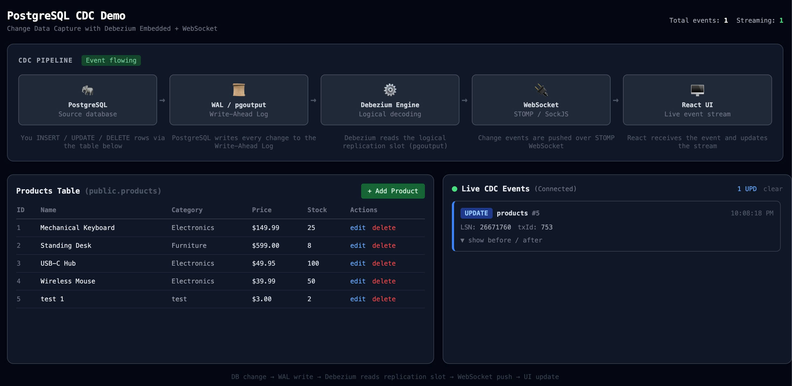
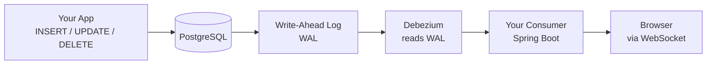
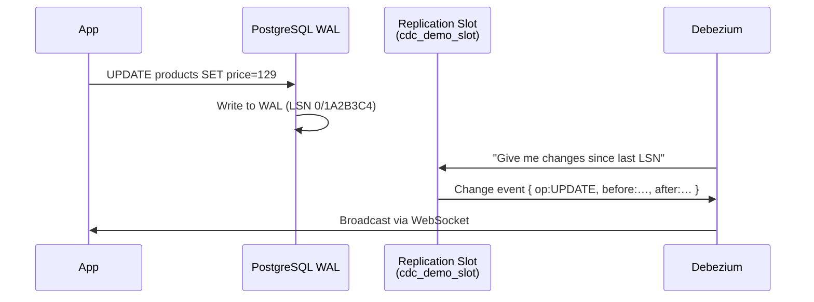
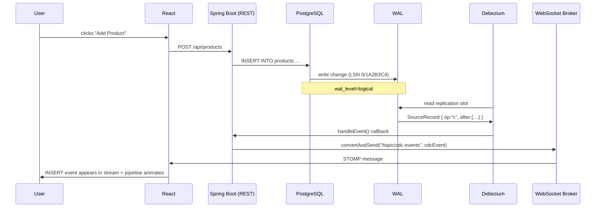

# PostgreSQL CDC Demo

> **Change Data Capture** — watch every database change flow in real-time from PostgreSQL to your browser.



---

## What is CDC?

**Change Data Capture (CDC)** is a pattern that continuously tracks every `INSERT`, `UPDATE`, and `DELETE` that happens in a database and turns each change into an **event** that other systems can consume.

Instead of polling the database ("has anything changed?"), CDC *pushes* changes to you the moment they happen — without modifying your existing tables or application code.



---

## How PostgreSQL Makes CDC Possible

### The Write-Ahead Log (WAL)

Every change PostgreSQL commits is first written to the **WAL** — a sequential log file on disk. Its primary purpose is crash recovery, but it also enables replication and CDC.

```
WAL entry example (simplified):
  LSN 0/1A2B3C4  |  table: products  |  op: UPDATE
  before: { id:1, price: 149.99 }
  after:  { id:1, price: 129.99 }
```

**LSN** (Log Sequence Number) is the unique offset of each entry in the WAL — like a byte address in the log file.

### Logical Decoding

By default the WAL is a binary, low-level format. **Logical decoding** transforms it into human-readable change events (rows inserted, updated, deleted) using an **output plugin**.

This demo uses `pgoutput` — the built-in output plugin shipped with PostgreSQL 10+. No extension to install.

### The Replication Slot

A **replication slot** is a cursor that remembers how far a consumer has read in the WAL. PostgreSQL guarantees it will not discard WAL entries until the slot has consumed them.



---

## The Most Important Config

Everything lives in `DebeziumConfig.java`. These properties are what make CDC work:

```java
// 1. Tell PostgreSQL to write logical (row-level) changes to the WAL
//    Default is "replica" which only stores physical changes.
//    Without this, logical decoding is impossible.
.with("wal_level", "logical")            // set on the DB server (see docker-compose.yml)

// 2. Use pgoutput — the native PostgreSQL output plugin (no extension needed)
.with("plugin.name", "pgoutput")

// 3. Name of the replication slot Debezium will create and read from
.with("slot.name", "cdc_demo_slot")

// 4. Drop the slot when the app shuts down (good for dev — avoids stale slots)
.with("slot.drop.on.stop", "true")

// 5. Which tables to watch (schema.table format)
.with("table.include.list", "public.products")

// 6. On first start: snapshot existing rows, then switch to streaming
.with("snapshot.mode", "initial")
```

And in `docker-compose.yml` on the PostgreSQL service — the **single most critical line**:

```yaml
command: postgres -c wal_level=logical
```

Without `wal_level=logical`, PostgreSQL only logs physical byte changes. Logical decoding — and therefore Debezium — cannot work.

### REPLICA IDENTITY FULL

By default, `UPDATE` and `DELETE` events only carry the primary key in the `before` image. To see the full old row (so you can show a proper before/after diff), set:

```sql
ALTER TABLE products REPLICA IDENTITY FULL;
```

This tells PostgreSQL to write the entire old row to the WAL on every update/delete.

| Without REPLICA IDENTITY FULL | With REPLICA IDENTITY FULL |
|---|---|
| before: `{ id: 1 }` | before: `{ id: 1, name: "Keyboard", price: 149.99, … }` |
| after: `{ id: 1, price: 129.99, … }` | after: `{ id: 1, name: "Keyboard", price: 129.99, … }` |

---

## What is Debezium?

**Debezium** is an open-source CDC library by Red Hat. It connects to a database's internal change stream (the WAL in PostgreSQL's case) and converts raw log entries into structured change events.

Normally Debezium runs as a **Kafka Connect** plugin, streaming events into Apache Kafka. For this demo we use **Debezium Embedded** — a mode that runs the entire engine as a library inside our Spring Boot process, with no Kafka required.

```
┌─────────────────────────────────────────────────┐
│  Spring Boot Process                            │
│                                                 │
│  ┌──────────────────────────────────────────┐   │
│  │  Debezium Embedded Engine                │   │
│  │  - opens a PostgreSQL replication slot   │   │
│  │  - reads WAL entries via pgoutput        │   │
│  │  - calls handleEvent() for each change   │   │
│  └──────────────────┬───────────────────────┘   │
│                     │ ChangeEvent<SourceRecord>  │
│                     ▼                           │
│  DebeziumListenerService.handleEvent()          │
│  - extracts op / before / after                 │
│  - builds a CdcEvent DTO                        │
│  - broadcasts via SimpMessagingTemplate         │
└─────────────────────────────────────────────────┘
```

Key Debezium dependency in `pom.xml`:

```xml
<!-- The embedded engine runtime -->
<dependency>
    <groupId>io.debezium</groupId>
    <artifactId>debezium-embedded</artifactId>
    <version>2.7.4.Final</version>
</dependency>

<!-- The PostgreSQL connector (contains pgoutput support) -->
<dependency>
    <groupId>io.debezium</groupId>
    <artifactId>debezium-connector-postgres</artifactId>
    <version>2.7.4.Final</version>
</dependency>
```

---

## How the Java Backend Receives a CDC Event

### 1. The Engine is Started (`DebeziumListenerService.java`)

```java
@PostConstruct
public void start() {
    engine = DebeziumEngine
        .create(ChangeEventFormat.of(Connect.class))
        .using(debeziumConfiguration.asProperties())
        .notifying(this::handleEvent)   // <-- our callback
        .build();

    executorService.submit(engine);     // runs on a background thread
}
```

Debezium opens a replication slot in PostgreSQL and starts reading the WAL. Every time it finds a change, it calls `handleEvent`.

### 2. The Event is Decoded (`handleEvent`)

A raw Debezium event is a Kafka Connect `SourceRecord`. Its value is a `Struct` with this shape:

```
Struct {
  op:     "c" | "u" | "d" | "r"    (create / update / delete / snapshot-read)
  before: Struct { id, name, price, … }   // null for INSERT
  after:  Struct { id, name, price, … }   // null for DELETE
  source: Struct {
    lsn:   26668952          // WAL position
    txId:  588               // PostgreSQL transaction ID
    table: "products"
  }
}
```

```java
private void handleEvent(RecordChangeEvent<SourceRecord> changeEvent) {
    SourceRecord record = changeEvent.record();
    Struct valueStruct = (Struct) record.value();

    // Skip non-data records (heartbeats, transaction markers)
    if (valueStruct.schema().field("op") == null) return;

    String op = valueStruct.getString("op");  // "c", "u", "d", "r"

    CdcEvent event = new CdcEvent();
    event.setOperation(mapOperation(op));          // "INSERT", "UPDATE", …
    event.setBefore(structToMap(valueStruct, "before"));
    event.setAfter(structToMap(valueStruct, "after"));
    event.setLsn(extractLsn(valueStruct));

    // Push to all WebSocket subscribers
    messagingTemplate.convertAndSend("/topic/cdc-events", event);
}
```

### 3. The Event is Pushed to the Browser (WebSocket / STOMP)

The backend uses **Spring WebSocket with STOMP** — a simple messaging protocol over WebSocket.

```
Browser                          Spring Boot
  │                                   │
  │── CONNECT /ws ──────────────────► │
  │◄─ CONNECTED ──────────────────── │
  │                                   │
  │── SUBSCRIBE /topic/cdc-events ──► │
  │                                   │
  │   [user does INSERT via REST]      │
  │                                   │
  │◄─ MESSAGE /topic/cdc-events ───── │  { op: "INSERT", after: {…} }
  │◄─ MESSAGE /topic/cdc-events ───── │  (next change)
```

The React frontend subscribes using `@stomp/stompjs`:

```typescript
client.subscribe('/topic/cdc-events', (message) => {
    const event: CdcEvent = JSON.parse(message.body)
    setEvents(prev => [event, ...prev])
})
```

---

## Full Event Flow (end to end)



---

## Project Structure

```
cdc-demo/
├── docker-compose.yml              # Starts all 3 services
├── backend/
│   ├── Dockerfile
│   ├── pom.xml
│   └── src/main/java/com/cdcdemo/
│       ├── config/
│       │   ├── DebeziumConfig.java      # All connector properties
│       │   └── WebSocketConfig.java     # STOMP endpoint setup
│       ├── service/
│       │   └── DebeziumListenerService.java  # Handles CDC events
│       ├── controller/
│       │   └── ProductController.java   # REST CRUD endpoints
│       └── dto/
│           └── CdcEvent.java            # WebSocket message shape
└── frontend/
    └── src/
        ├── hooks/useWebSocket.ts        # STOMP connection
        └── components/
            ├── PipelineDiagram.tsx      # Animated pipeline stages
            ├── ProductTable.tsx         # CRUD table
            └── EventStream.tsx          # Live event feed
```

---

## Quick Start

```bash
git clone <repo>
cd cdc-demo
docker compose up --build
```

Open **http://localhost:3000**

> **Note:** If port 5432 is already in use (local PostgreSQL), the demo maps PostgreSQL to port **5433** on the host. The containers communicate internally so this does not affect the demo.

---

## Glossary

| Term | Meaning |
|---|---|
| **WAL** | Write-Ahead Log — PostgreSQL's sequential log of every committed change |
| **Logical decoding** | Transforms binary WAL into row-level change events |
| **pgoutput** | Built-in PostgreSQL output plugin for logical decoding (no install needed) |
| **Replication slot** | A named cursor in the WAL; PostgreSQL won't discard entries until the slot has read them |
| **LSN** | Log Sequence Number — unique byte offset of a WAL entry |
| **Debezium** | Open-source CDC library that reads the WAL and emits structured events |
| **REPLICA IDENTITY FULL** | Table setting that writes the full old row to WAL on UPDATE/DELETE |
| **STOMP** | Simple text protocol for messaging over WebSocket |
| **SockJS** | WebSocket fallback library used by Spring for browser compatibility |
